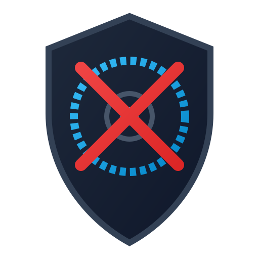

  
  <h1 align="center">🪓 HDD Sanitizer Enterprise</h1>

Eine moderne C# / Avalonia UI Anwendung zur sicheren und zertifizierten Datenlöschung von Festplatten (HDD/SSD/NVMe) unter Verwendung der Seagate openSeaChest CLI.

## ✨ Features
* 🔍 **Hardware-Erkennung:** Automatische Auslesung von angeschlossenen Laufwerken (WMI).
* 🛡️ **Safety Guard:** Automatische Sperre von Systemlaufwerken (Windows-Partitionen).
* ⚙️ **Low-Level Erasure:** Unterstützung für Native Sanitize, Zero-Fill & Crypto Erase.
* 📺 **Live-Monitoring:** Terminal-Output & Fortschrittsabfrage laufender Löschvorgänge.
* 📜 **Audit Trail & PDF Exporter:** Automatische JSON-Zertifikate und professioneller PDF-Export.

---

## 🚀 Vorbereitung & Installation

### 1. openSeaChest CLI herunterladen
Da openSeaChest ein externes Open-Source-Tool von Seagate ist, wird es nicht mit diesem Repository ausgeliefert.

1. Lade die neueste Windows-Version von GitHub (Seagate/openSeaChest) herunter.
2. Kopiere die Datei openSeaChest_Erase.exe direkt in den Hauptordner dieses Projekts.

### 2. Anwendung als Administrator starten
Da die App direkten Hardware-Zugriff auf Laufwerkscontroller benötigt, muss sie mit Administratorrechten gestartet werden:

dotnet run --project src/HddSanitizer.App/HddSanitizer.App.csproj

---

## 📄 License & Credits

Dieses Projekt steht unter der **MIT-Lizenz** – siehe [LICENSE](LICENSE) für Details.

### Third-Party Software
* **[Seagate openSeaChest](https://github.com/Seagate/openSeaChest)** – Lizenziert unter [MPL 2.0](https://www.mozilla.org/MPL/2.0/).
* **[Avalonia UI](https://github.com/AvaloniaUI/Avalonia)** – Lizenziert unter [MIT License](https://github.com/AvaloniaUI/Avalonia/blob/master/LICENSE).
* **[QuestPDF](https://github.com/QuestPDF/QuestPDF)** – Lizenziert unter der [QuestPDF Community License](https://www.questpdf.com/license/) (Kostenlos für Open-Source / KMU).

> **💡 Hinweis zu Windows SmartScreen:**

> **💡 Hinweis zu Windows SmartScreen:**
> Da es sich um eine Open-Source-Anwendung ohne gekauftes Code-Signing-Zertifikat handelt, zeigt Windows beim ersten Start eventuell eine SmartScreen-Meldung an (*"Der Computer wurde durch Windows geschützt"*). Klicke einfach auf **"Weitere Informationen"** ➔ **"Trotzdem ausführen"**.
